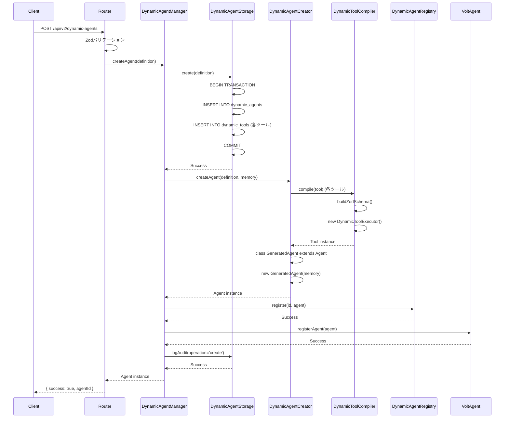
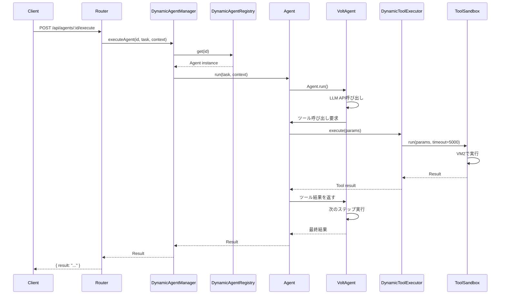

# アーキテクチャ設計書

## ドキュメント情報

| 項目 | 内容 |
|------|------|
| **ドキュメントバージョン** | 1.0.0 |
| **最終更新日** | 2026-01-29 |
| **ステータス** | Draft |

## 1. アーキテクチャ概要

### 1.1 アーキテクチャ戦略: Strategy B（0から新規構築）

既存システムから完全に独立した新システムを構築し、最小限の統合ポイントで接続する。

**設計原則**:
1. **完全な分離**: 独立したディレクトリ、データベース、APIネームスペース
2. **障害の隔離**: 動的システムの障害が静的システムに影響を与えない
3. **最小統合**: `index.ts`の3行のみで統合
4. **段階的ロールアウト**: フィーチャーフラグで制御

### 1.2 システム全体図

```
┌─────────────────────────────────────────────────────────────┐
│                         クライアント                           │
│                    (Browser / CLI / API)                     │
└────────────────┬────────────────────────────────────────────┘
                 │
                 │ HTTP/HTTPS
                 │
┌────────────────▼────────────────────────────────────────────┐
│                      Express Server                          │
│                       (index.ts)                             │
├─────────────────────────────────────────────────────────────┤
│  ┌──────────────────┐         ┌──────────────────────┐     │
│  │  Static System   │         │  Dynamic System      │     │
│  │  (既存・変更なし)  │         │  (新規・独立)         │     │
│  ├──────────────────┤         ├──────────────────────┤     │
│  │ API:             │         │ API:                 │     │
│  │ /api/agents      │         │ /api/v2/dynamic-     │     │
│  │                  │         │   agents             │     │
│  ├──────────────────┤         ├──────────────────────┤     │
│  │ agentService.ts  │         │ dynamicSystem.ts     │     │
│  │ agents/          │         │ src/dynamic/         │     │
│  │ - chat           │         │ - managers/          │     │
│  │ - admin          │         │ - agents/            │     │
│  │ - agentGenerator │         │ - tools/             │     │
│  │                  │         │ - storage/           │     │
│  └─────────┬────────┘         └──────────┬───────────┘     │
│            │                             │                  │
│            │                             │                  │
│  ┌─────────▼────────┐         ┌──────────▼───────────┐     │
│  │ memory.db        │         │ dynamic_agents.db    │     │
│  │ (変更なし)        │         │ (新規・独立)          │     │
│  └──────────────────┘         └──────────────────────┘     │
└─────────────────────────────────────────────────────────────┘
                 │
                 │
┌────────────────▼────────────────────────────────────────────┐
│                     VoltAgent Framework                      │
│               (agents: [...static, ...dynamic])              │
└─────────────────────────────────────────────────────────────┘
```

### 1.3 統合ポイント

**index.ts での統合（3行のみ）**:
```typescript
// 既存の静的エージェント初期化
const agents = { chat, admin, agentGenerator };

// 動的システム初期化
const dynamicSystem = new DynamicSystem(memory, db);
const dynamicAgents = await dynamicSystem.initialize();

// VoltAgent に統合
const voltAgent = new VoltAgent({
  agents: { ...agents, ...dynamicAgents }, // ← 統合ポイント
  // ... 他の設定
});
```

---

## 2. コンポーネント設計

### 2.1 ディレクトリ構造

```
apps/server/src/
├── dynamic/                              # 新規動的システム（完全独立）
│   ├── dynamicSystem.ts                  # エントリーポイント
│   ├── managers/
│   │   ├── DynamicAgentManager.ts        # エージェントライフサイクル管理
│   │   └── DynamicAgentRegistry.ts       # エージェント登録・検索
│   ├── agents/
│   │   ├── DynamicAgentCreator.ts        # エージェントインスタンス生成
│   │   └── DynamicAgentLoader.ts         # DB復元・初期化
│   ├── tools/
│   │   ├── DynamicToolCompiler.ts        # ツールコンパイル
│   │   ├── DynamicToolExecutor.ts        # ツール実行（サンドボックス）
│   │   └── ToolSandbox.ts                # VM2サンドボックス管理
│   ├── storage/
│   │   ├── DynamicAgentStorage.ts        # エージェントDB操作
│   │   ├── DynamicToolStorage.ts         # ツールDB操作
│   │   └── AuditLogStorage.ts            # 監査ログDB操作
│   ├── api/
│   │   ├── dynamicAgentsRouter.ts        # /api/v2/dynamic-agents ルート
│   │   ├── validators.ts                 # Zodバリデーションスキーマ
│   │   └── errorHandlers.ts              # エラーハンドリング
│   ├── types/
│   │   ├── dynamicAgent.types.ts         # 型定義
│   │   └── dynamicTool.types.ts          # ツール型定義
│   └── utils/
│       ├── logger.ts                     # 動的システム専用ログ
│       └── featureFlags.ts               # フィーチャーフラグ管理
│
├── agents/                               # 既存静的エージェント（変更なし）
│   ├── ChatAgent.ts
│   ├── AdminAgent.ts
│   └── AgentGeneratorAgent_local.ts
│
├── services/                             # 既存サービス（小修正のみ）
│   └── agentService.ts                   # getAllAgentsInfo() 拡張
│
└── index.ts                              # メインエントリーポイント（統合）
```

### 2.2 コンポーネント責務

#### 2.2.1 DynamicSystem（エントリーポイント）

**責務**:
- 動的システム全体の初期化
- 各コンポーネントのインスタンス化
- VoltAgentとの統合インターフェース提供

**インターフェース**:
```typescript
export class DynamicSystem {
  private manager: DynamicAgentManager;
  private registry: DynamicAgentRegistry;

  constructor(memory: Memory, db: LibSQL) {
    // コンポーネント初期化
  }

  async initialize(): Promise<Record<string, Agent>> {
    // 動的エージェントをロードして返す
  }

  getManager(): DynamicAgentManager {
    // マネージャーへのアクセス
  }

  getRouter(): Router {
    // Express Routerを返す
  }
}
```

#### 2.2.2 DynamicAgentManager（ライフサイクル管理）

**責務**:
- エージェントの作成・更新・削除
- エージェントの有効化・無効化
- VoltAgentへの登録・解除

**インターフェース**:
```typescript
export class DynamicAgentManager {
  private creator: DynamicAgentCreator;
  private loader: DynamicAgentLoader;
  private registry: DynamicAgentRegistry;
  private storage: DynamicAgentStorage;

  async createAgent(definition: DynamicAgentDefinition): Promise<Agent> {
    // 1. バリデーション
    // 2. DB保存
    // 3. エージェント生成
    // 4. レジストリ登録
    // 5. VoltAgent登録
    // 6. 監査ログ
  }

  async updateAgent(id: string, updates: Partial<DynamicAgentDefinition>): Promise<Agent> {
    // 1. 既存エージェント取得
    // 2. バリデーション
    // 3. DB更新
    // 4. エージェント再生成
    // 5. レジストリ更新
    // 6. 監査ログ
  }

  async deleteAgent(id: string): Promise<void> {
    // 1. レジストリ解除
    // 2. VoltAgent解除
    // 3. DB論理削除
    // 4. 監査ログ
  }

  async loadAllAgents(memory: Memory): Promise<Agent[]> {
    // 起動時に全エージェントをロード
  }
}
```

#### 2.2.3 DynamicAgentCreator（エージェント生成）

**責務**:
- エージェント定義からAgentインスタンスを生成
- ツールのアタッチ
- テスト例の設定

**インターフェース**:
```typescript
export class DynamicAgentCreator {
  private toolCompiler: DynamicToolCompiler;

  createAgent(
    definition: DynamicAgentDefinition,
    memory: Memory
  ): Agent {
    // 1. ツールをコンパイル
    const tools = definition.tools.map(t => this.toolCompiler.compile(t));

    // 2. 動的Agentクラスを生成
    class GeneratedAgent extends Agent {
      constructor(memory: Memory) {
        super({
          name: definition.agentId,
          instructions: definition.instructions,
          tools,
          model: definition.model,
        });
      }
    }

    // 3. インスタンス化
    return new GeneratedAgent(memory);
  }
}
```

#### 2.2.4 DynamicToolCompiler & DynamicToolExecutor（ツール管理）

**責務**:
- ツール定義のコンパイル
- ツールの安全な実行（サンドボックス）
- エラーハンドリング

**インターフェース**:
```typescript
export class DynamicToolCompiler {
  compile(toolDef: DynamicToolDefinition): Tool {
    // 1. Zodスキーマ生成
    const parametersSchema = this.buildZodSchema(toolDef.parameters);

    // 2. 実行関数生成
    const executor = new DynamicToolExecutor(toolDef.implementation);

    // 3. Toolインスタンス返却
    return new Tool({
      name: toolDef.name,
      description: toolDef.description,
      parameters: parametersSchema,
      execute: async (params) => executor.execute(params),
    });
  }
}

export class DynamicToolExecutor {
  private sandbox: ToolSandbox;

  constructor(implementation: string) {
    this.sandbox = new ToolSandbox(implementation);
  }

  async execute(params: Record<string, any>): Promise<any> {
    try {
      return await this.sandbox.run(params, { timeout: 5000 });
    } catch (error) {
      logger.error('Tool execution error', { error, params });
      throw new ToolExecutionError(error.message);
    }
  }
}
```

#### 2.2.5 ToolSandbox（セキュリティ）

**責務**:
- VM2サンドボックスの管理
- 許可されたAPIのみ提供
- タイムアウト・リソース制限

**インターフェース**:
```typescript
export class ToolSandbox {
  private vm: VM;

  constructor(implementation: string) {
    this.vm = new VM({
      timeout: 5000,
      sandbox: {
        fetch,
        console: logger,
        // その他許可されたAPI
      },
    });

    this.compiledFunction = this.vm.run(`
      (async (params) => {
        ${implementation}
      })
    `);
  }

  async run(params: Record<string, any>, options?: { timeout: number }): Promise<any> {
    return await this.compiledFunction(params);
  }
}
```

#### 2.2.6 DynamicAgentStorage（データアクセス層）

**責務**:
- `dynamic_agents.db`へのCRUD操作
- トランザクション管理
- エラーハンドリング

**インターフェース**:
```typescript
export class DynamicAgentStorage {
  constructor(private db: LibSQL) {}

  async create(definition: DynamicAgentDefinition): Promise<void> {
    await this.db.execute({
      sql: `INSERT INTO dynamic_agents (...) VALUES (...)`,
      args: [...],
    });
  }

  async findById(id: string): Promise<DynamicAgentDefinition | null> {
    const result = await this.db.execute({
      sql: `SELECT * FROM dynamic_agents WHERE id = ? AND status = 'active'`,
      args: [id],
    });
    return result.rows[0] || null;
  }

  async findAll(): Promise<DynamicAgentDefinition[]> {
    const result = await this.db.execute({
      sql: `SELECT * FROM dynamic_agents WHERE status = 'active' ORDER BY created_at DESC`,
      args: [],
    });
    return result.rows;
  }

  async update(id: string, updates: Partial<DynamicAgentDefinition>): Promise<void> {
    // UPDATE with version increment
  }

  async delete(id: string): Promise<void> {
    // Logical delete (status = 'deleted')
  }
}
```

#### 2.2.7 DynamicAgentRegistry（インメモリレジストリ）

**責務**:
- 実行中エージェントのキャッシュ
- 高速検索
- VoltAgentとの同期

**インターフェース**:
```typescript
export class DynamicAgentRegistry {
  private agents: Map<string, Agent> = new Map();

  register(id: string, agent: Agent): void {
    this.agents.set(id, agent);
  }

  unregister(id: string): void {
    this.agents.delete(id);
  }

  get(id: string): Agent | undefined {
    return this.agents.get(id);
  }

  getAll(): Agent[] {
    return Array.from(this.agents.values());
  }

  getAllIds(): string[] {
    return Array.from(this.agents.keys());
  }
}
```

---

## 3. データフロー

### 3.1 エージェント作成フロー

```
Client
  │
  │ POST /api/v2/dynamic-agents
  │ { agentId, displayName, description, instructions, tools }
  │
  ▼
Express Router (dynamicAgentsRouter.ts)
  │
  │ Zodバリデーション
  │
  ▼
DynamicAgentManager.createAgent()
  │
  ├─► 1. DynamicAgentStorage.create()
  │       └─► dynamic_agents.db (INSERT)
  │
  ├─► 2. DynamicToolStorage.createMany()
  │       └─► dynamic_agents.db (INSERT tools)
  │
  ├─► 3. DynamicAgentCreator.createAgent()
  │       │
  │       ├─► DynamicToolCompiler.compile() (各ツール)
  │       │     └─► ToolSandbox.new()
  │       │
  │       └─► new GeneratedAgent(memory)
  │
  ├─► 4. DynamicAgentRegistry.register()
  │       └─► インメモリキャッシュ
  │
  ├─► 5. voltAgent.registerAgent()
  │       └─► VoltAgentフレームワークに登録
  │
  └─► 6. AuditLogStorage.log()
        └─► dynamic_agents.db (INSERT audit_log)
  │
  ▼
Response: { success: true, agentId }
```

### 3.2 エージェント実行フロー

```
Client
  │
  │ POST /api/agents/:agentId/execute
  │ { task, context }
  │
  ▼
Express Router (index.ts)
  │
  ▼
DynamicAgentManager.executeAgent()
  │
  ├─► 1. DynamicAgentRegistry.get(agentId)
  │       └─► インメモリキャッシュから取得
  │
  ├─► 2. agent.run(task, context)
  │       │
  │       └─► VoltAgent Agent.run()
  │             │
  │             ├─► LLM呼び出し
  │             │
  │             └─► ツール呼び出し（必要に応じて）
  │                   │
  │                   └─► DynamicToolExecutor.execute()
  │                         └─► ToolSandbox.run()
  │                               └─► VM2で実行
  │
  └─► 3. (オプション) AuditLogStorage.logExecution()
  │
  ▼
Response: { result: "..." }
```

### 3.3 サーバー起動時の復元フロー

```
Server Start (index.ts)
  │
  ▼
DynamicSystem.initialize()
  │
  ▼
DynamicAgentManager.loadAllAgents()
  │
  ├─► 1. DynamicAgentStorage.findAll()
  │       └─► dynamic_agents.db (SELECT * WHERE status='active')
  │
  ├─► 2. 各エージェントについて:
  │       │
  │       ├─► DynamicToolStorage.findByAgentId()
  │       │     └─► dynamic_agents.db (SELECT tools)
  │       │
  │       ├─► DynamicAgentCreator.createAgent()
  │       │     └─► new GeneratedAgent(memory)
  │       │
  │       ├─► DynamicAgentRegistry.register()
  │       │
  │       └─► voltAgent.registerAgent()
  │
  └─► 3. ログ出力: "Loaded N dynamic agents"
  │
  ▼
VoltAgent({ agents: {...static, ...dynamic} })
```

---

## 4. シーケンス図

### 4.1 エージェント作成（詳細）



### 4.2 エージェント実行（詳細）



---

## 5. 状態管理

### 5.1 エージェントライフサイクル

```
┌──────────┐
│  Draft   │  (将来の拡張)
└────┬─────┘
     │ create()
     ▼
┌──────────┐
│  Active  │ ◄──┐
└────┬─────┘    │ enable()
     │          │
     │ disable()│
     ▼          │
┌──────────┐    │
│ Inactive │ ───┘
└────┬─────┘
     │ delete()
     ▼
┌──────────┐
│ Deleted  │ (論理削除)
└──────────┘
```

**状態遷移**:
| 現在の状態 | イベント | 次の状態 | 副作用 |
|-----------|---------|---------|--------|
| - | `create()` | Active | VoltAgentに登録、レジストリ追加 |
| Active | `disable()` | Inactive | VoltAgentから解除、レジストリ保持 |
| Inactive | `enable()` | Active | VoltAgentに再登録 |
| Active | `delete()` | Deleted | VoltAgentから解除、レジストリ削除 |
| Inactive | `delete()` | Deleted | レジストリ削除 |

### 5.2 データ永続性

**インメモリ状態**:
- `DynamicAgentRegistry`: 実行中エージェントのキャッシュ
- `VoltAgent`: 登録済みエージェント

**永続化状態**:
- `dynamic_agents.db`: エージェント定義、ツール定義

**同期戦略**:
- サーバー起動時: DB → レジストリ → VoltAgent
- エージェント作成時: DB → レジストリ → VoltAgent（並行）
- エージェント削除時: VoltAgent → レジストリ → DB（順次）

---

## 6. エラーハンドリング

### 6.1 エラー階層

```
Error
├── DynamicAgentError (基底クラス)
│   ├── AgentNotFoundError (404)
│   ├── AgentAlreadyExistsError (409)
│   ├── AgentValidationError (400)
│   ├── ToolCompilationError (400)
│   ├── ToolExecutionError (500)
│   ├── DatabaseError (500)
│   └── SandboxError (500)
```

### 6.2 エラーハンドリング戦略

| エラー種類 | 対応 | HTTPステータス |
|-----------|------|---------------|
| **バリデーションエラー** | 詳細メッセージを返す | 400 Bad Request |
| **重複エラー** | 既存IDを返す | 409 Conflict |
| **NotFoundエラー** | エラーメッセージを返す | 404 Not Found |
| **ツールコンパイルエラー** | コンパイルエラー詳細を返す | 400 Bad Request |
| **ツール実行エラー** | ログに記録、エラーメッセージを返す | 500 Internal Server Error |
| **DBエラー** | ログに記録、汎用エラーメッセージ | 500 Internal Server Error |
| **サンドボックスタイムアウト** | タイムアウトエラーを返す | 500 Internal Server Error |

### 6.3 リトライ戦略

| 操作 | リトライ | 条件 |
|-----|---------|------|
| **DB書き込み** | 3回 | 一時的なDB接続エラー |
| **VoltAgent登録** | 2回 | 一時的なフレームワークエラー |
| **ツール実行** | なし | ユーザーコードのエラー |

---

## 7. パフォーマンス最適化

### 7.1 キャッシング戦略

| キャッシュ対象 | 戦略 | 無効化タイミング |
|--------------|------|----------------|
| **エージェントインスタンス** | インメモリ（Registry） | 更新・削除時 |
| **ツールコンパイル結果** | インメモリ（ToolSandbox） | ツール更新時 |
| **エージェント一覧** | なし（動的） | - |

### 7.2 遅延ロード

**起動時**:
- 動的エージェントは全てロード（MVP）
- 将来: 最近使用されたN個のみロード

**実行時**:
- ツールは初回実行時にコンパイル
- コンパイル結果はキャッシュ

### 7.3 パフォーマンス目標

| メトリクス | 目標 | 測定方法 |
|----------|------|---------|
| **エージェント作成** | < 2秒 | API応答時間 |
| **エージェント一覧取得** | < 500ms | API応答時間 |
| **起動時ロード** | +5秒以内（100エージェント） | サーバー起動時間 |
| **メモリ使用量** | +500MB（50エージェント） | プロセスメモリ |

---

## 8. セキュリティアーキテクチャ

### 8.1 防御層

```
┌─────────────────────────────────────────┐
│ Layer 1: API認証・認可                   │
│ - API key検証                           │
│ - ユーザーロール確認                      │
└─────────────────┬───────────────────────┘
                  │
┌─────────────────▼───────────────────────┐
│ Layer 2: 入力バリデーション               │
│ - Zodスキーマバリデーション               │
│ - SQLインジェクション防止                │
│ - XSS防止                               │
└─────────────────┬───────────────────────┘
                  │
┌─────────────────▼───────────────────────┐
│ Layer 3: レート制限                      │
│ - エージェント作成: 10 req/hour          │
│ - エージェント実行: 100 req/hour         │
└─────────────────┬───────────────────────┘
                  │
┌─────────────────▼───────────────────────┐
│ Layer 4: サンドボックス実行              │
│ - VM2隔離                               │
│ - タイムアウト5秒                        │
│ - ホワイトリストAPIのみ                  │
└─────────────────┬───────────────────────┘
                  │
┌─────────────────▼───────────────────────┐
│ Layer 5: 監査ログ                       │
│ - 全操作をログ記録                       │
│ - ユーザーID、タイムスタンプ記録          │
└─────────────────────────────────────────┘
```

### 8.2 サンドボックス詳細

**VM2 サンドボックス（MVP）**:
```typescript
const vm = new VM({
  timeout: 5000,
  sandbox: {
    // 許可されたAPI
    fetch,
    console: logger,
  },
  // 禁止
  // - require()
  // - process
  // - __dirname, __filename
  // - fs
});
```

**Worker Threads（プロダクション推奨・将来）**:
- 完全なプロセス隔離
- CPUリソース制限
- メモリ制限

---

## 9. スケーラビリティ

### 9.1 垂直スケーリング

| リソース | 現状 | スケーリング戦略 |
|---------|------|----------------|
| **CPU** | シングルスレッド | Worker Threadsでマルチスレッド化 |
| **メモリ** | 制限なし | エージェントあたり10MB制限 |
| **ディスク** | 制限なし | DB圧縮、古いエージェントアーカイブ |

### 9.2 水平スケーリング

**MVP**: 単一インスタンス

**将来**:
- Redis for Registry共有
- DB レプリケーション
- ロードバランサー

---

## 10. 監視とロギング

### 10.1 ログ構造

```json
{
  "timestamp": "2026-01-29T12:34:56.789Z",
  "level": "INFO",
  "component": "DynamicAgentManager",
  "operation": "createAgent",
  "agentId": "myAgent",
  "userId": "user123",
  "duration": 1234,
  "status": "success"
}
```

### 10.2 メトリクス

| メトリクス | 説明 | アラート |
|----------|------|---------|
| `dynamic_agents_total` | 動的エージェント総数 | > 1000 |
| `dynamic_agent_creation_duration_seconds` | エージェント作成時間 | P95 > 5秒 |
| `dynamic_agent_execution_duration_seconds` | エージェント実行時間 | P95 > 30秒 |
| `dynamic_tool_execution_errors_total` | ツール実行エラー数 | > 10/分 |
| `dynamic_system_memory_bytes` | 動的システムメモリ使用量 | > 1GB |

---

## 11. テスト戦略

### 11.1 テストレイヤー

```
┌────────────────────────────────────┐
│ E2E Tests (7-test-plan.md)        │
│ - API統合テスト                    │
│ - サーバー起動・復元テスト          │
└────────────────────────────────────┘
           │
┌──────────▼─────────────────────────┐
│ Integration Tests                 │
│ - DynamicAgentManager + Storage   │
│ - DynamicAgentCreator + Compiler  │
└────────────────────────────────────┘
           │
┌──────────▼─────────────────────────┐
│ Unit Tests                        │
│ - 各クラス・メソッド個別テスト      │
│ - モック・スタブで依存関係分離      │
└────────────────────────────────────┘
```

---

## 12. デプロイアーキテクチャ

### 12.1 フィーチャーフラグ

```typescript
// src/dynamic/utils/featureFlags.ts
export const FEATURE_FLAGS = {
  ENABLE_DYNAMIC_AGENTS: process.env.ENABLE_DYNAMIC_AGENTS === 'true',
  ENABLE_DYNAMIC_TOOLS: process.env.ENABLE_DYNAMIC_TOOLS === 'true',
};

// index.ts
if (FEATURE_FLAGS.ENABLE_DYNAMIC_AGENTS) {
  const dynamicSystem = new DynamicSystem(memory, db);
  const dynamicAgents = await dynamicSystem.initialize();
  // ...
}
```

### 12.2 ロールアウトステージ

```
Stage 1: 内部テスト
└─► ENABLE_DYNAMIC_AGENTS=true (内部環境)

Stage 2: 限定ユーザー
└─► ENABLE_DYNAMIC_AGENTS=true (10%ユーザー)

Stage 3: 全体ロールアウト
└─► ENABLE_DYNAMIC_AGENTS=true (全ユーザー)
```

---

## 13. ロールバック戦略

### 13.1 緊急ロールバック（1分）

```bash
# フィーチャーフラグをOFF
export ENABLE_DYNAMIC_AGENTS=false

# サーバー再起動
npm run restart
```

### 13.2 完全削除（5分）

```bash
# 動的システムディレクトリ削除
rm -rf src/dynamic/

# DBファイル削除
rm dynamic_agents.db

# index.ts の統合コード削除（3行）

# サーバー再起動
npm run restart
```

---

## 14. 将来の拡張

### 14.1 Phase 1（完了後）

- バージョニング
- 動的エージェント間の依存関係
- フロントエンドUI

### 14.2 Phase 2

- Worker Threads隔離
- マーケットプレイス機能
- 高度な分析・レポート

---

## 15. アーキテクチャ決定記録（ADR）

### ADR-001: Strategy Bを選択

**コンテキスト**: 既存システムへの影響を最小化しつつ、動的エージェント機能を追加

**決定**: Strategy B（0から新規構築）を採用

**理由**:
- 安全性: 障害分離、簡単なロールバック
- 保守性: 明確な責任分離
- デプロイ: フィーチャーフラグで段階的ロールアウト

**結果**: 開発期間+2-3日、安定性・保守性の大幅向上

### ADR-002: 専用データベース（dynamic_agents.db）

**コンテキスト**: データ永続化の方法

**決定**: 既存`memory.db`と分離した`dynamic_agents.db`を使用

**理由**:
- 障害分離
- 独立監視
- 簡単なロールバック（DBファイル削除のみ）

**結果**: DB運用の複雑性+10%、安全性+90%

### ADR-003: VM2サンドボックス（MVP）→ Worker Threads（プロダクション）

**コンテキスト**: 動的コード実行の隔離方法

**決定**: MVPではVM2、プロダクション対応時にWorker Threads

**理由**:
- VM2: 実装が簡単、MVP検証に十分
- Worker Threads: 完全なプロセス隔離、プロダクション推奨

**結果**: MVP開発期間短縮、プロダクション対応は将来タスク

---

**Next Steps**: [03-database-design.md](./03-database-design.md) でデータベース設計を確認してください。
