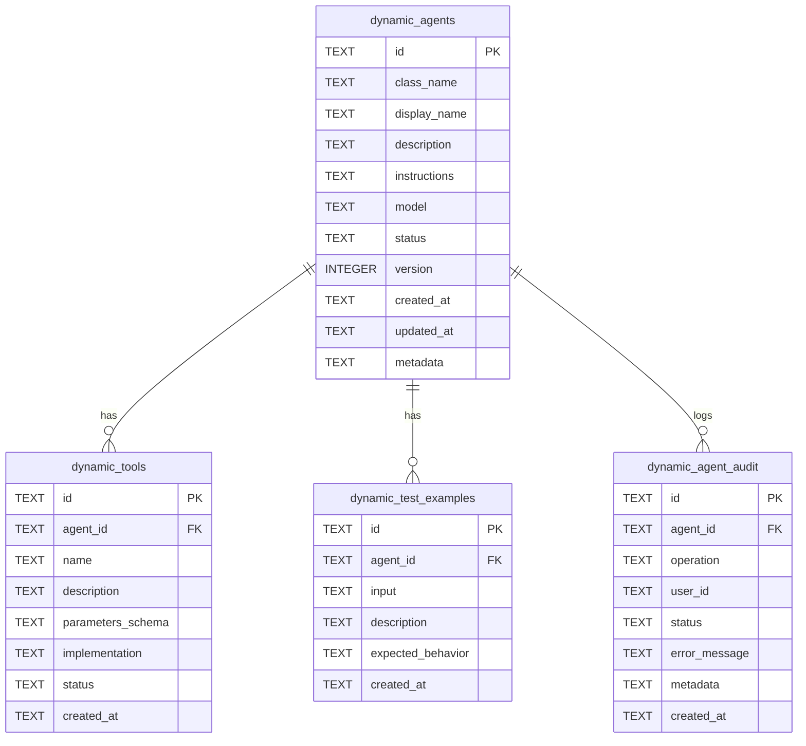

# データベース設計書

## ドキュメント情報

| 項目 | 内容 |
|------|------|
| **ドキュメントバージョン** | 1.0.0 |
| **最終更新日** | 2026-01-29 |
| **ステータス** | Draft |

## 1. 概要

### 1.1 データベース戦略

**専用データベース**: `dynamic_agents.db`（既存`memory.db`と完全分離）

**理由**:
- 障害分離: 動的システムのDB問題が既存システムに影響しない
- 独立監視: 動的エージェントのパフォーマンスを別途監視
- 簡単なロールバック: DBファイル削除のみで完全削除
- マイグレーション安全: 既存DB構造に影響を与えない

### 1.2 データベース技術スタック

| 項目 | 技術 |
|------|------|
| **データベースエンジン** | LibSQL (Turso) |
| **ORM/Query Builder** | Raw SQL (LibSQL Client) |
| **マイグレーションツール** | カスタムマイグレーションスクリプト |
| **バックアップ** | ファイルコピー |

---

## 2. ERD（Entity Relationship Diagram）



---

## 3. テーブル定義

### 3.1 dynamic_agents（動的エージェント定義）

**目的**: 動的エージェントのメタデータと定義を保存

```sql
CREATE TABLE dynamic_agents (
  -- Primary Key
  id TEXT PRIMARY KEY,                    -- エージェントID（ユーザー指定）例: "weatherAgent"

  -- 基本情報
  class_name TEXT NOT NULL,               -- 生成されるクラス名 例: "WeatherAgent"
  display_name TEXT NOT NULL,             -- 表示名 例: "Weather Agent"
  description TEXT NOT NULL,              -- エージェントの説明
  instructions TEXT NOT NULL,             -- エージェントへの指示（プロンプト）

  -- 設定
  model TEXT NOT NULL DEFAULT 'openai/gpt-4o-mini',  -- 使用するLLMモデル
  status TEXT NOT NULL DEFAULT 'active',  -- ステータス: 'active', 'inactive', 'deleted'
  version INTEGER NOT NULL DEFAULT 1,     -- バージョン番号（更新時にインクリメント）

  -- タイムスタンプ
  created_at TEXT NOT NULL DEFAULT CURRENT_TIMESTAMP,
  updated_at TEXT NOT NULL DEFAULT CURRENT_TIMESTAMP,

  -- 拡張用
  metadata TEXT                           -- JSON形式の拡張メタデータ
);
```

**カラム詳細**:

| カラム | 型 | Null | デフォルト | 説明 |
|-------|---|------|----------|------|
| `id` | TEXT | No | - | エージェントID（ユーザー指定、一意） |
| `class_name` | TEXT | No | - | TypeScriptクラス名（キャメルケース） |
| `display_name` | TEXT | No | - | UIに表示される名前 |
| `description` | TEXT | No | - | エージェントの機能説明 |
| `instructions` | TEXT | No | - | エージェントに与えるシステムプロンプト |
| `model` | TEXT | No | `openai/gpt-4o-mini` | LLMモデル識別子 |
| `status` | TEXT | No | `active` | `active`, `inactive`, `deleted` |
| `version` | INTEGER | No | 1 | バージョン番号（更新時に自動インクリメント） |
| `created_at` | TEXT | No | CURRENT_TIMESTAMP | 作成日時（ISO 8601形式） |
| `updated_at` | TEXT | No | CURRENT_TIMESTAMP | 最終更新日時 |
| `metadata` | TEXT | Yes | NULL | 拡張メタデータ（JSON） |

**制約**:
```sql
-- ステータス値の制約
CHECK (status IN ('active', 'inactive', 'deleted'))

-- バージョンは正の整数
CHECK (version > 0)
```

**インデックス**:
```sql
-- ステータス検索用
CREATE INDEX idx_dynamic_agents_status ON dynamic_agents(status);

-- 作成日時検索用
CREATE INDEX idx_dynamic_agents_created_at ON dynamic_agents(created_at DESC);
```

**データ例**:
```sql
INSERT INTO dynamic_agents (
  id, class_name, display_name, description, instructions, model
) VALUES (
  'weatherAgent',
  'WeatherAgent',
  'Weather Agent',
  'Get current weather information for any location',
  'あなたは天気情報を提供するエージェントです。ユーザーが指定した場所の天気を正確に返してください。',
  'openai/gpt-4o-mini'
);
```

---

### 3.2 dynamic_tools（動的ツール定義）

**目的**: エージェントに紐づくツールの実装を保存

```sql
CREATE TABLE dynamic_tools (
  -- Primary Key
  id TEXT PRIMARY KEY,                    -- ツールID（UUID）

  -- 外部キー
  agent_id TEXT NOT NULL,                 -- エージェントID

  -- ツール定義
  name TEXT NOT NULL,                     -- ツール名 例: "getCurrentWeather"
  description TEXT NOT NULL,              -- ツールの説明
  parameters_schema TEXT NOT NULL,        -- Zodスキーマ（JSON）
  implementation TEXT NOT NULL,           -- JavaScript関数実装（文字列）

  -- 設定
  status TEXT NOT NULL DEFAULT 'active',  -- ステータス: 'active', 'inactive'

  -- タイムスタンプ
  created_at TEXT NOT NULL DEFAULT CURRENT_TIMESTAMP,

  -- 外部キー制約
  FOREIGN KEY (agent_id) REFERENCES dynamic_agents(id) ON DELETE CASCADE
);
```

**カラム詳細**:

| カラム | 型 | Null | デフォルト | 説明 |
|-------|---|------|----------|------|
| `id` | TEXT | No | - | ツールID（UUID v4） |
| `agent_id` | TEXT | No | - | 所属エージェントID |
| `name` | TEXT | No | - | ツール名（キャメルケース） |
| `description` | TEXT | No | - | ツールの機能説明 |
| `parameters_schema` | TEXT | No | - | パラメータスキーマ（JSON） |
| `implementation` | TEXT | No | - | JavaScript関数本体 |
| `status` | TEXT | No | `active` | `active`, `inactive` |
| `created_at` | TEXT | No | CURRENT_TIMESTAMP | 作成日時 |

**制約**:
```sql
-- agent_idとname の組み合わせは一意
CREATE UNIQUE INDEX idx_dynamic_tools_agent_name ON dynamic_tools(agent_id, name);

-- ステータス値の制約
CHECK (status IN ('active', 'inactive'))
```

**インデックス**:
```sql
-- エージェントIDによる検索用
CREATE INDEX idx_dynamic_tools_agent_id ON dynamic_tools(agent_id);
```

**parameters_schema フォーマット例**:
```json
[
  {
    "name": "location",
    "zodType": "string",
    "description": "City name or zip code"
  },
  {
    "name": "units",
    "zodType": "enum",
    "zodOptions": ["celsius", "fahrenheit"],
    "description": "Temperature units",
    "optional": true
  }
]
```

**implementation フォーマット例**:
```javascript
// パラメータ: { location, units }
const response = await fetch(`https://api.weather.com?location=${location}&units=${units}`);
const data = await response.json();
return {
  temperature: data.temp,
  condition: data.condition,
  humidity: data.humidity
};
```

**データ例**:
```sql
INSERT INTO dynamic_tools (
  id, agent_id, name, description, parameters_schema, implementation
) VALUES (
  'tool-uuid-1234',
  'weatherAgent',
  'getCurrentWeather',
  'Get current weather for a location',
  '[{"name":"location","zodType":"string","description":"City name"}]',
  'const response = await fetch(`https://api.weather.com?location=${location}`); return await response.json();'
);
```

---

### 3.3 dynamic_test_examples（テスト例）

**目的**: エージェントのテストケースを保存

```sql
CREATE TABLE dynamic_test_examples (
  -- Primary Key
  id TEXT PRIMARY KEY,                    -- テスト例ID（UUID）

  -- 外部キー
  agent_id TEXT NOT NULL,                 -- エージェントID

  -- テストケース
  input TEXT NOT NULL,                    -- テスト入力
  description TEXT NOT NULL,              -- テストケースの説明
  expected_behavior TEXT NOT NULL,        -- 期待される動作

  -- タイムスタンプ
  created_at TEXT NOT NULL DEFAULT CURRENT_TIMESTAMP,

  -- 外部キー制約
  FOREIGN KEY (agent_id) REFERENCES dynamic_agents(id) ON DELETE CASCADE
);
```

**カラム詳細**:

| カラム | 型 | Null | デフォルト | 説明 |
|-------|---|------|----------|------|
| `id` | TEXT | No | - | テスト例ID（UUID） |
| `agent_id` | TEXT | No | - | 所属エージェントID |
| `input` | TEXT | No | - | テスト入力文字列 |
| `description` | TEXT | No | - | テストケースの説明 |
| `expected_behavior` | TEXT | No | - | 期待される出力・動作 |
| `created_at` | TEXT | No | CURRENT_TIMESTAMP | 作成日時 |

**インデックス**:
```sql
-- エージェントIDによる検索用
CREATE INDEX idx_dynamic_test_examples_agent_id ON dynamic_test_examples(agent_id);
```

**データ例**:
```sql
INSERT INTO dynamic_test_examples (
  id, agent_id, input, description, expected_behavior
) VALUES (
  'test-uuid-1234',
  'weatherAgent',
  'What is the weather in Tokyo?',
  'Basic weather query',
  'Should return current weather information for Tokyo'
);
```

---

### 3.4 dynamic_agent_audit（監査ログ）

**目的**: エージェントに対する操作を記録（セキュリティ・トレーサビリティ）

```sql
CREATE TABLE dynamic_agent_audit (
  -- Primary Key
  id TEXT PRIMARY KEY,                    -- 監査ログID（UUID）

  -- 監査情報
  agent_id TEXT NOT NULL,                 -- エージェントID
  operation TEXT NOT NULL,                -- 操作: 'create', 'update', 'delete', 'execute'
  user_id TEXT,                           -- ユーザーID（認証実装後）
  status TEXT NOT NULL,                   -- ステータス: 'success', 'failure'
  error_message TEXT,                     -- エラーメッセージ（失敗時）
  metadata TEXT,                          -- 追加情報（JSON）

  -- タイムスタンプ
  created_at TEXT NOT NULL DEFAULT CURRENT_TIMESTAMP
);
```

**カラム詳細**:

| カラム | 型 | Null | デフォルト | 説明 |
|-------|---|------|----------|------|
| `id` | TEXT | No | - | 監査ログID（UUID） |
| `agent_id` | TEXT | No | - | 操作対象エージェントID |
| `operation` | TEXT | No | - | `create`, `update`, `delete`, `execute`, `enable`, `disable` |
| `user_id` | TEXT | Yes | NULL | 操作実行ユーザーID（認証実装後） |
| `status` | TEXT | No | - | `success`, `failure` |
| `error_message` | TEXT | Yes | NULL | エラーメッセージ（失敗時のみ） |
| `metadata` | TEXT | Yes | NULL | 追加情報（JSON形式） |
| `created_at` | TEXT | No | CURRENT_TIMESTAMP | 操作日時 |

**制約**:
```sql
-- 操作タイプの制約
CHECK (operation IN ('create', 'update', 'delete', 'execute', 'enable', 'disable'))

-- ステータスの制約
CHECK (status IN ('success', 'failure'))
```

**インデックス**:
```sql
-- エージェントIDによる検索用
CREATE INDEX idx_dynamic_agent_audit_agent_id ON dynamic_agent_audit(agent_id);

-- 日時検索用（最近の監査ログ取得）
CREATE INDEX idx_dynamic_agent_audit_created_at ON dynamic_agent_audit(created_at DESC);

-- ユーザーID検索用
CREATE INDEX idx_dynamic_agent_audit_user_id ON dynamic_agent_audit(user_id);

-- 操作タイプ検索用
CREATE INDEX idx_dynamic_agent_audit_operation ON dynamic_agent_audit(operation);
```

**metadata フォーマット例**:
```json
{
  "duration_ms": 1234,
  "request_ip": "192.168.1.1",
  "changes": {
    "before": {"model": "openai/gpt-4o-mini"},
    "after": {"model": "openai/gpt-4o"}
  }
}
```

**データ例**:
```sql
INSERT INTO dynamic_agent_audit (
  id, agent_id, operation, user_id, status, metadata
) VALUES (
  'audit-uuid-1234',
  'weatherAgent',
  'create',
  'user-123',
  'success',
  '{"duration_ms": 1234, "request_ip": "192.168.1.1"}'
);
```

---

## 4. マイグレーションスクリプト

### 4.1 初期マイグレーション（001_initial_schema.sql）

```sql
-- ファイル: migrations/001_initial_schema.sql
-- 説明: 動的エージェントシステムの初期スキーマ

-- ====================================
-- 1. dynamic_agents テーブル
-- ====================================
CREATE TABLE IF NOT EXISTS dynamic_agents (
  id TEXT PRIMARY KEY,
  class_name TEXT NOT NULL,
  display_name TEXT NOT NULL,
  description TEXT NOT NULL,
  instructions TEXT NOT NULL,
  model TEXT NOT NULL DEFAULT 'openai/gpt-4o-mini',
  status TEXT NOT NULL DEFAULT 'active' CHECK (status IN ('active', 'inactive', 'deleted')),
  version INTEGER NOT NULL DEFAULT 1 CHECK (version > 0),
  created_at TEXT NOT NULL DEFAULT CURRENT_TIMESTAMP,
  updated_at TEXT NOT NULL DEFAULT CURRENT_TIMESTAMP,
  metadata TEXT
);

-- インデックス
CREATE INDEX IF NOT EXISTS idx_dynamic_agents_status
  ON dynamic_agents(status);
CREATE INDEX IF NOT EXISTS idx_dynamic_agents_created_at
  ON dynamic_agents(created_at DESC);

-- ====================================
-- 2. dynamic_tools テーブル
-- ====================================
CREATE TABLE IF NOT EXISTS dynamic_tools (
  id TEXT PRIMARY KEY,
  agent_id TEXT NOT NULL,
  name TEXT NOT NULL,
  description TEXT NOT NULL,
  parameters_schema TEXT NOT NULL,
  implementation TEXT NOT NULL,
  status TEXT NOT NULL DEFAULT 'active' CHECK (status IN ('active', 'inactive')),
  created_at TEXT NOT NULL DEFAULT CURRENT_TIMESTAMP,
  FOREIGN KEY (agent_id) REFERENCES dynamic_agents(id) ON DELETE CASCADE
);

-- インデックス
CREATE INDEX IF NOT EXISTS idx_dynamic_tools_agent_id
  ON dynamic_tools(agent_id);
CREATE UNIQUE INDEX IF NOT EXISTS idx_dynamic_tools_agent_name
  ON dynamic_tools(agent_id, name);

-- ====================================
-- 3. dynamic_test_examples テーブル
-- ====================================
CREATE TABLE IF NOT EXISTS dynamic_test_examples (
  id TEXT PRIMARY KEY,
  agent_id TEXT NOT NULL,
  input TEXT NOT NULL,
  description TEXT NOT NULL,
  expected_behavior TEXT NOT NULL,
  created_at TEXT NOT NULL DEFAULT CURRENT_TIMESTAMP,
  FOREIGN KEY (agent_id) REFERENCES dynamic_agents(id) ON DELETE CASCADE
);

-- インデックス
CREATE INDEX IF NOT EXISTS idx_dynamic_test_examples_agent_id
  ON dynamic_test_examples(agent_id);

-- ====================================
-- 4. dynamic_agent_audit テーブル
-- ====================================
CREATE TABLE IF NOT EXISTS dynamic_agent_audit (
  id TEXT PRIMARY KEY,
  agent_id TEXT NOT NULL,
  operation TEXT NOT NULL CHECK (operation IN ('create', 'update', 'delete', 'execute', 'enable', 'disable')),
  user_id TEXT,
  status TEXT NOT NULL CHECK (status IN ('success', 'failure')),
  error_message TEXT,
  metadata TEXT,
  created_at TEXT NOT NULL DEFAULT CURRENT_TIMESTAMP
);

-- インデックス
CREATE INDEX IF NOT EXISTS idx_dynamic_agent_audit_agent_id
  ON dynamic_agent_audit(agent_id);
CREATE INDEX IF NOT EXISTS idx_dynamic_agent_audit_created_at
  ON dynamic_agent_audit(created_at DESC);
CREATE INDEX IF NOT EXISTS idx_dynamic_agent_audit_user_id
  ON dynamic_agent_audit(user_id);
CREATE INDEX IF NOT EXISTS idx_dynamic_agent_audit_operation
  ON dynamic_agent_audit(operation);
```

### 4.2 マイグレーション実行スクリプト（TypeScript）

```typescript
// src/dynamic/storage/migrations.ts
import { createClient } from '@libsql/client';
import { readFileSync } from 'fs';
import { join } from 'path';

export async function runMigrations(dbPath: string): Promise<void> {
  const db = createClient({
    url: `file:${dbPath}`,
  });

  // マイグレーションテーブルの作成
  await db.execute(`
    CREATE TABLE IF NOT EXISTS schema_migrations (
      version INTEGER PRIMARY KEY,
      name TEXT NOT NULL,
      applied_at TEXT NOT NULL DEFAULT CURRENT_TIMESTAMP
    )
  `);

  // 既に実行済みのマイグレーションを取得
  const appliedMigrations = await db.execute(`
    SELECT version FROM schema_migrations ORDER BY version
  `);
  const appliedVersions = new Set(appliedMigrations.rows.map(r => r.version));

  // マイグレーションファイルのリスト
  const migrations = [
    { version: 1, name: '001_initial_schema.sql' },
    // 将来のマイグレーションをここに追加
  ];

  // 未適用のマイグレーションを実行
  for (const migration of migrations) {
    if (!appliedVersions.has(migration.version)) {
      console.log(`Applying migration ${migration.name}...`);

      const sql = readFileSync(
        join(__dirname, '../../migrations', migration.name),
        'utf8'
      );

      // トランザクション内で実行
      await db.batch([
        { sql: 'BEGIN' },
        { sql },
        {
          sql: `INSERT INTO schema_migrations (version, name) VALUES (?, ?)`,
          args: [migration.version, migration.name],
        },
        { sql: 'COMMIT' },
      ], 'write');

      console.log(`Migration ${migration.name} applied successfully`);
    }
  }

  console.log('All migrations applied');
}
```

---

## 5. データアクセスパターン

### 5.1 エージェント作成

```typescript
// トランザクション
await db.batch([
  // 1. エージェント作成
  {
    sql: `INSERT INTO dynamic_agents (id, class_name, display_name, description, instructions, model)
          VALUES (?, ?, ?, ?, ?, ?)`,
    args: [id, className, displayName, description, instructions, model],
  },
  // 2. ツール作成（複数）
  ...tools.map(tool => ({
    sql: `INSERT INTO dynamic_tools (id, agent_id, name, description, parameters_schema, implementation)
          VALUES (?, ?, ?, ?, ?, ?)`,
    args: [tool.id, id, tool.name, tool.description, JSON.stringify(tool.parametersSchema), tool.implementation],
  })),
  // 3. 監査ログ
  {
    sql: `INSERT INTO dynamic_agent_audit (id, agent_id, operation, user_id, status)
          VALUES (?, ?, 'create', ?, 'success')`,
    args: [auditId, id, userId],
  },
], 'write');
```

### 5.2 エージェント取得（ツール含む）

```typescript
// 1. エージェント取得
const agent = await db.execute({
  sql: `SELECT * FROM dynamic_agents WHERE id = ? AND status = 'active'`,
  args: [id],
});

// 2. ツール取得
const tools = await db.execute({
  sql: `SELECT * FROM dynamic_tools WHERE agent_id = ? AND status = 'active'`,
  args: [id],
});

// 3. マージ
return {
  ...agent.rows[0],
  tools: tools.rows,
};
```

### 5.3 エージェント一覧取得

```typescript
const agents = await db.execute({
  sql: `SELECT id, display_name, description, status, created_at
        FROM dynamic_agents
        WHERE status = 'active'
        ORDER BY created_at DESC
        LIMIT ? OFFSET ?`,
  args: [limit, offset],
});
```

### 5.4 エージェント更新

```typescript
await db.batch([
  // 1. エージェント更新
  {
    sql: `UPDATE dynamic_agents
          SET display_name = ?, description = ?, instructions = ?,
              version = version + 1, updated_at = CURRENT_TIMESTAMP
          WHERE id = ?`,
    args: [displayName, description, instructions, id],
  },
  // 2. 監査ログ
  {
    sql: `INSERT INTO dynamic_agent_audit (id, agent_id, operation, user_id, status, metadata)
          VALUES (?, ?, 'update', ?, 'success', ?)`,
    args: [auditId, id, userId, JSON.stringify({ changes })],
  },
], 'write');
```

---

## 6. パフォーマンス最適化

### 6.1 インデックス戦略

| テーブル | インデックス | 用途 | 効果 |
|---------|------------|------|------|
| `dynamic_agents` | `status` | アクティブエージェントのフィルタ | 全テーブルスキャン回避 |
| `dynamic_agents` | `created_at DESC` | 新しいエージェントの取得 | ソート不要 |
| `dynamic_tools` | `agent_id` | エージェントのツール取得 | JOIN高速化 |
| `dynamic_tools` | `(agent_id, name)` UNIQUE | 重複チェック | 一意性保証+検索高速化 |
| `dynamic_agent_audit` | `created_at DESC` | 最近の監査ログ取得 | ソート不要 |

### 6.2 クエリ最適化

**N+1問題の回避**:
```typescript
// ❌ 悪い例: N+1クエリ
const agents = await getAgents();
for (const agent of agents) {
  agent.tools = await getTools(agent.id); // N回のクエリ
}

// ✅ 良い例: バッチ取得
const agents = await getAgents();
const agentIds = agents.map(a => a.id);
const toolsMap = await getToolsByAgentIds(agentIds); // 1回のクエリ
agents.forEach(agent => {
  agent.tools = toolsMap[agent.id] || [];
});
```

### 6.3 接続プーリング

```typescript
// LibSQL connection pool
const db = createClient({
  url: `file:${dbPath}`,
  // 将来: Turso remote database
  // authToken: process.env.TURSO_AUTH_TOKEN,
});
```

---

## 7. バックアップ・リストア戦略

### 7.1 バックアップ

**定期バックアップ（Cron）**:
```bash
#!/bin/bash
# backup-dynamic-db.sh

BACKUP_DIR="/backups/dynamic-agents"
TIMESTAMP=$(date +%Y%m%d_%H%M%S)
DB_FILE="dynamic_agents.db"

# バックアップ
cp $DB_FILE $BACKUP_DIR/dynamic_agents_$TIMESTAMP.db

# 古いバックアップを削除（30日以上）
find $BACKUP_DIR -name "dynamic_agents_*.db" -mtime +30 -delete
```

**手動バックアップ（API）**:
```typescript
// POST /api/v2/dynamic-agents/backup
export async function backupDatabase(): Promise<string> {
  const timestamp = new Date().toISOString().replace(/:/g, '-');
  const backupPath = `./backups/dynamic_agents_${timestamp}.db`;

  await copyFile('./dynamic_agents.db', backupPath);

  return backupPath;
}
```

### 7.2 リストア

```typescript
// POST /api/v2/dynamic-agents/restore
export async function restoreDatabase(backupPath: string): Promise<void> {
  // 1. サーバー停止（フィーチャーフラグOFF）
  FEATURE_FLAGS.ENABLE_DYNAMIC_AGENTS = false;

  // 2. DBファイル置換
  await copyFile(backupPath, './dynamic_agents.db');

  // 3. サーバー再起動
  // npm run restart
}
```

---

## 8. データ整合性

### 8.1 外部キー制約

```sql
-- カスケード削除: エージェント削除時にツールも削除
FOREIGN KEY (agent_id) REFERENCES dynamic_agents(id) ON DELETE CASCADE
```

### 8.2 トランザクション

**ACID保証**:
```typescript
// エージェント作成は全てトランザクション内で実行
await db.batch([
  { sql: 'BEGIN' },
  { sql: 'INSERT INTO dynamic_agents ...' },
  { sql: 'INSERT INTO dynamic_tools ...' },
  { sql: 'INSERT INTO dynamic_agent_audit ...' },
  { sql: 'COMMIT' },
], 'write');
```

### 8.3 楽観的ロック

```typescript
// バージョン番号を使用した楽観的ロック
const result = await db.execute({
  sql: `UPDATE dynamic_agents
        SET instructions = ?, version = version + 1
        WHERE id = ? AND version = ?`,
  args: [newInstructions, id, currentVersion],
});

if (result.rowsAffected === 0) {
  throw new ConflictError('Agent was modified by another user');
}
```

---

## 9. データ保持ポリシー

### 9.1 論理削除

```sql
-- 物理削除しない（status = 'deleted'）
UPDATE dynamic_agents SET status = 'deleted', updated_at = CURRENT_TIMESTAMP WHERE id = ?;
```

### 9.2 監査ログ保持

| ログタイプ | 保持期間 | アーカイブ戦略 |
|----------|---------|--------------|
| **作成・更新・削除** | 1年 | 年次アーカイブテーブルに移動 |
| **実行ログ** | 30日 | 月次削除 |

### 9.3 アーカイブ

```sql
-- 1年以上前の監査ログをアーカイブテーブルに移動
INSERT INTO dynamic_agent_audit_archive
SELECT * FROM dynamic_agent_audit
WHERE created_at < datetime('now', '-1 year');

DELETE FROM dynamic_agent_audit
WHERE created_at < datetime('now', '-1 year');
```

---

## 10. セキュリティ

### 10.1 SQLインジェクション対策

**常にパラメータ化クエリを使用**:
```typescript
// ✅ 安全
const result = await db.execute({
  sql: `SELECT * FROM dynamic_agents WHERE id = ?`,
  args: [userId],
});

// ❌ 危険（絶対に使用しない）
const result = await db.execute({
  sql: `SELECT * FROM dynamic_agents WHERE id = '${userId}'`,
});
```

### 10.2 データ暗号化

**機密情報の暗号化（将来）**:
- API keys
- 外部サービス認証情報

```typescript
// 例: metadata フィールドの暗号化
const encryptedMetadata = encrypt(JSON.stringify(metadata), process.env.ENCRYPTION_KEY);
```

---

## 11. モニタリング

### 11.1 メトリクス

```typescript
// Prometheus メトリクス
const dbQueryDuration = new Histogram({
  name: 'dynamic_db_query_duration_seconds',
  help: 'Database query duration',
  labelNames: ['operation', 'table'],
});

const dbErrors = new Counter({
  name: 'dynamic_db_errors_total',
  help: 'Database errors',
  labelNames: ['operation', 'table'],
});
```

### 11.2 スロークエリログ

```typescript
export async function logSlowQuery(sql: string, duration: number): Promise<void> {
  if (duration > 1000) { // 1秒以上
    logger.warn('Slow query detected', { sql, duration });
  }
}
```

---

## 12. 将来の拡張

### 12.1 マイグレーション例（バージョニング追加）

```sql
-- 002_add_versioning.sql
ALTER TABLE dynamic_agents ADD COLUMN parent_version_id TEXT;
ALTER TABLE dynamic_agents ADD FOREIGN KEY (parent_version_id) REFERENCES dynamic_agents(id);

CREATE INDEX idx_dynamic_agents_parent_version ON dynamic_agents(parent_version_id);
```

### 12.2 パーティショニング（将来）

```sql
-- 監査ログを月別にパーティション
CREATE TABLE dynamic_agent_audit_2026_01 AS
SELECT * FROM dynamic_agent_audit
WHERE created_at >= '2026-01-01' AND created_at < '2026-02-01';
```

---

**Next Steps**: [04-api-specification.md](./04-api-specification.md) でAPI設計を確認してください。
