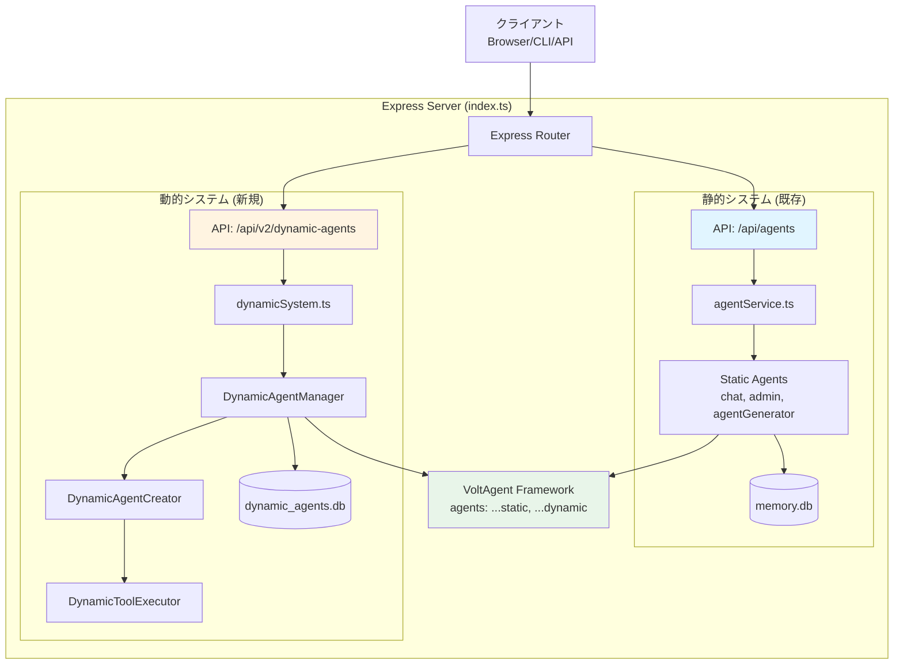
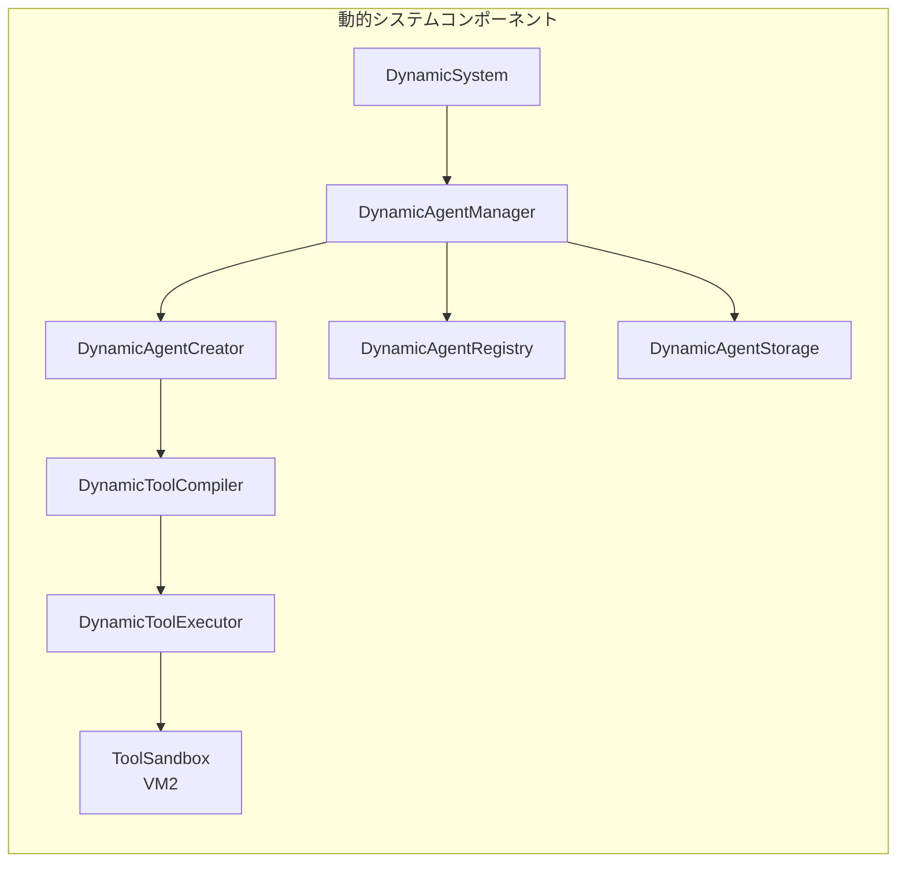
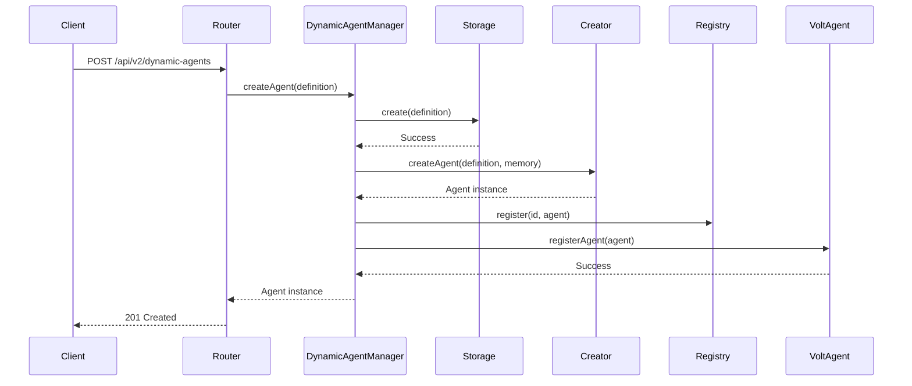

# アーキテクチャ概要図

## システム全体図

```mermaid
graph TB
    Client[クライアント<br/>Browser/CLI/API]

    subgraph "Express Server (index.ts)"
        Router[Express Router]

        subgraph "静的システム (既存)"
            StaticAPI[API: /api/agents]
            AgentService[agentService.ts]
            StaticAgents[Static Agents<br/>chat, admin, agentGenerator]
            MemoryDB[(memory.db)]
        end

        subgraph "動的システム (新規)"
            DynamicAPI[API: /api/v2/dynamic-agents]
            DynamicSystem[dynamicSystem.ts]
            DynamicManager[DynamicAgentManager]
            DynamicCreator[DynamicAgentCreator]
            ToolExecutor[DynamicToolExecutor]
            DynamicDB[(dynamic_agents.db)]
        end

        VoltAgent[VoltAgent Framework<br/>agents: ...static, ...dynamic]
    end

    Client --> Router
    Router --> StaticAPI
    Router --> DynamicAPI

    StaticAPI --> AgentService
    AgentService --> StaticAgents
    StaticAgents --> MemoryDB

    DynamicAPI --> DynamicSystem
    DynamicSystem --> DynamicManager
    DynamicManager --> DynamicCreator
    DynamicManager --> DynamicDB
    DynamicCreator --> ToolExecutor

    StaticAgents --> VoltAgent
    DynamicManager --> VoltAgent

    style StaticAPI fill:#e1f5ff
    style DynamicAPI fill:#fff4e1
    style VoltAgent fill:#e8f5e9
```

## コンポーネント関係図

```mermaid
graph LR
    subgraph "動的システムコンポーネント"
        A[DynamicSystem] --> B[DynamicAgentManager]
        B --> C[DynamicAgentCreator]
        B --> D[DynamicAgentRegistry]
        B --> E[DynamicAgentStorage]
        C --> F[DynamicToolCompiler]
        F --> G[DynamicToolExecutor]
        G --> H[ToolSandbox<br/>VM2]
    end
```

## データフロー図（エージェント作成）

```mermaid
sequenceDiagram
    participant C as Client
    participant R as Router
    participant M as DynamicAgentManager
    participant S as Storage
    participant CR as Creator
    participant RG as Registry
    participant V as VoltAgent

    C->>R: POST /api/v2/dynamic-agents
    R->>M: createAgent(definition)
    M->>S: create(definition)
    S-->>M: Success
    M->>CR: createAgent(definition, memory)
    CR-->>M: Agent instance
    M->>RG: register(id, agent)
    M->>V: registerAgent(agent)
    V-->>M: Success
    M-->>R: Agent instance
    R-->>C: 201 Created
```
